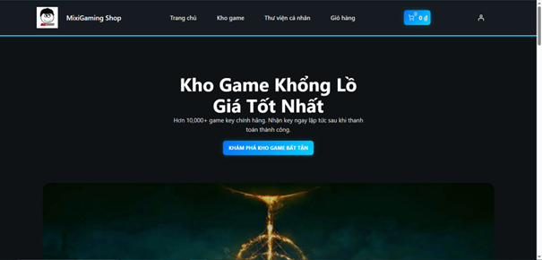
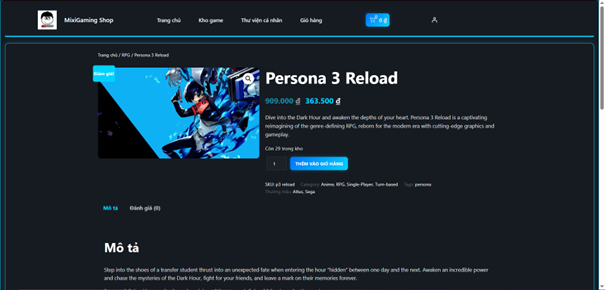
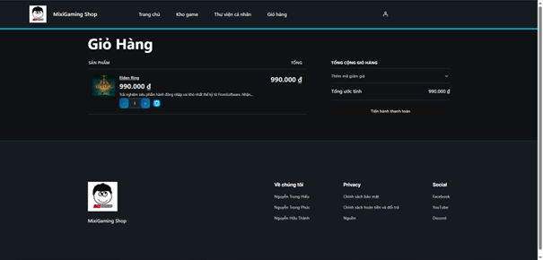
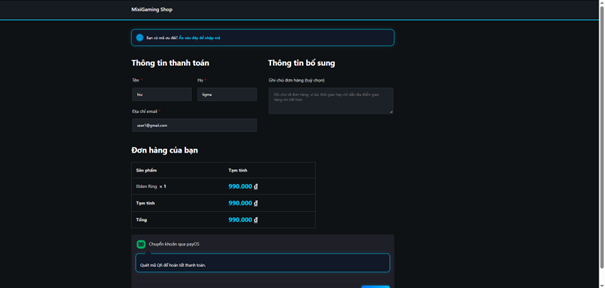
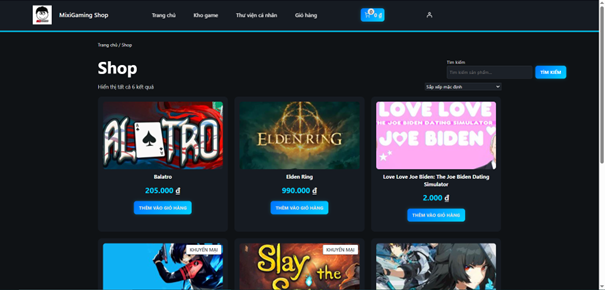
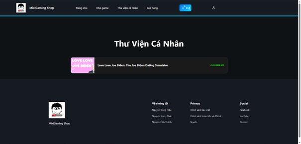
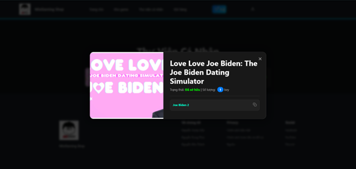

# MixiGaming Shop - Hệ thống bán game

## 1. Giới thiệu website/hệ thống
**MixiGaming Shop** là một hệ thống thương mại điện tử chuyên biệt dành cho việc kinh doanh các sản phẩm kỹ thuật số, cụ thể là mã kích hoạt trò chơi (Game Keys). Website được xây dựng nhằm mục đích tự động hóa quy trình phân phối sản phẩm số, giúp người dùng có thể mua và nhận Key Game ngay lập tức sau khi thanh toán thành công. Dự án tập trung vào tính trải nghiệm người dùng cao, giao diện tối giản, hiện đại và tích hợp các công nghệ mã nguồn mở tiên tiến nhất hiện nay.

## 2. Thông tin thành viên
| Họ và Tên | MSSV | Nhiệm vụ cụ thể |
| :--- | :--- | :--- |
| **Nguyễn Trung Hiếu** | **23810310387** | Trưởng nhóm, Cài đặt CMS, Phát triển Plugin thanh toán PayOS, Triển khai hạ tầng Cloud Pantheon. |
| **Nguyễn Hữu Thành** | **23810310389** | Thiết kế UI/UX. |
| **Nguyễn Trọng Phúc** | **23810310391** | Phát triển Plugin cấp Key Game, Thiết kế trang Thư viện game. |

## 3. Công nghệ sử dụng
Hệ thống được xây dựng trên nền tảng các công nghệ mã nguồn mở:
- **CMS:** WordPress
- **E-commerce:** WooCommerce
- **Ngôn ngữ:** PHP, JavaScript, HTML5, CSS3
- **Hosting/Cloud:** Pantheon (Hạ tầng điện toán đám mây)
- **Công cụ:** Git (Quản lý mã nguồn), PayOS (Cổng thanh toán)
- **Cơ sở dữ liệu:** MySQL

## 4. Hướng dẫn cài đặt & Chạy project
### Cài đặt môi trường Local:
1. **Chuẩn bị môi trường:** Cài đặt các phần mềm tạo môi trường PHP như XAMPP hoặc Laragon (PHP >= 7.4, MySQL >= 5.7).
2. **Sao chép mã nguồn:** Download hoặc Clone mã nguồn về thư mục web (`htdocs` đối với XAMPP hoặc `www` đối với Laragon).
3. **Cấu hình Cơ sở dữ liệu:**
   - Tạo một Database mới trong `phpMyAdmin`.
4. **Cấu hình Web:**
   - Đổi tên hoặc chỉnh sửa tệp `wp-config-local.php` để khai báo các thông số `DB_NAME`, `DB_USER`, `DB_PASSWORD` tương ứng với máy Local.
   - **Quan trọng:** Cập nhật lại `WP_HOME` và `WP_SITEURL` trong file cấu hình để trỏ về `http://localhost/ten-thu-muc` nhằm tránh lỗi chuyển hướng về link Pantheon.
5. **Cấu hình Đường dẫn tĩnh (.htaccess):**
   - Kiểm tra file `.htaccess` tại thư mục gốc, đảm bảo `RewriteBase` trỏ đúng vào thư mục hiện tại của project để tránh lỗi 404 khi truy cập các trang con.
6. **Hoàn tất:** Truy cập địa chỉ `localhost/ten-thu-muc` và đăng nhập vào quản trị bằng tài khoản admin.

### Chạy trên môi trường Production:
- Hệ thống đã được cấu hình CI/CD thông qua Git lên Pantheon. Mọi thay đổi trong mã nguồn sẽ được đồng bộ trực tiếp lên máy chủ thực tế.

## 5. Thông tin triển khai & Tài khoản demo
- **Link Online (Đã Deploy):** [https://dev-mixigaming.pantheonsite.io/](https://dev-mixigaming.pantheonsite.io/)
- **Tài khoản Quản trị (Admin):**
  - **Username:** `admin`
  - **Password:** `123456`

## 6. Hình ảnh minh họa hệ thống
- **Trang chủ:** Giao diện hiển thị danh sách các tựa game bản quyền nổi bật.

- **Trang chi tiết sản phẩm:** Thông tin mô tả game và nút đặt mua.

- **Trang Giỏ hàng:** Quản lý các sản phẩm đã chọn trước khi thanh toán.

- **Trang Thanh toán:** Tích hợp thông tin nhận hàng và lựa chọn phương thức thanh toán.

- **Trang Tài khoản:** Nơi người dùng đăng ký, đăng nhập và quản lý thông tin cá nhân.

- **Kho Game:** Danh sách các game người dùng đã sở hữu.

- **Thư viện Game Key:** Nơi hiển thị các Key Game đã mua sau khi đơn hàng được hệ thống xác nhận hoàn tất.

## 7. Video Demo
- **Link Video:** [https://drive.google.com/file/d/1_dtkNXXt4no8y5QNvqh58oY1Fj5oTSKY/view?usp=sharing]

---